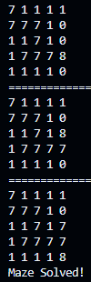

# BFS Array Maze Solver

## Description
The program uses the **Breadth First Search** solving algorithm to find a path through the maze.
It will print output a version of the maze to the console where 1's are walls and 0's are the paths
Each iteration it will print a copy of the maze where a 7 is where the the algorithm has checked and an 8 is where the algorithm is currently checking

## Instructions
To test your own mazes on the program you'll have to input your maze as a 2d array with dimensions *n* and *m* and a variable name of your choice
Then using the following line replacing variables *n* and *m* with your chosen dimensions you can initialize a maze solver class
```c++
MazeSolverGuy<n, m> name_of_solving_agent(name_of_maze);
```
Following this you can run the agent's solveMazeBFS method:
```c++
name_of_solving_agent.solveMazeBFS();
```

For the previous the variables you have to define are as follows:
- n
- m
- name_of_maze
- name_of_solving_agent


[Link to Repo](https://github.com/MassToTheMass/BFS-search-algorithm)

## Output

